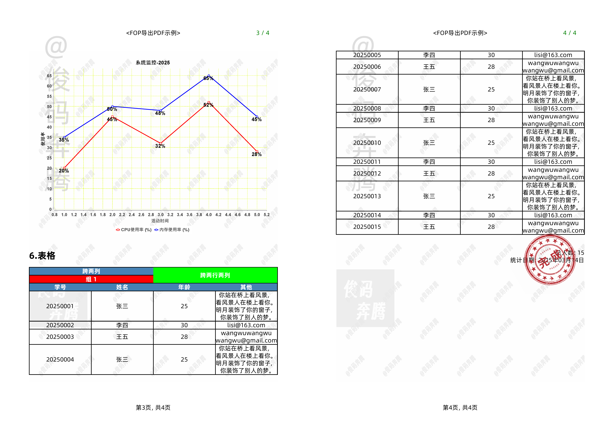

# play-with-pdf
My java demo project on handling pdf files.

## fop-thymeleaf
### Supports
+ Text paragraphs and lists 
+ Links and anchors 
+ qrcode / barcode 
+ charts 
+ tables 
+ images (png / svg) 
+ Paging 
+ TOC / bookmarks 
+ watermarks 

### Screenshots

